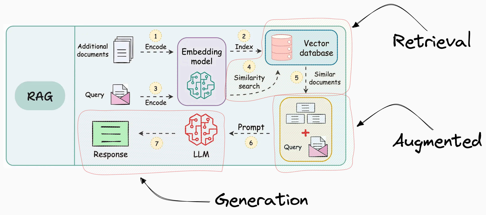
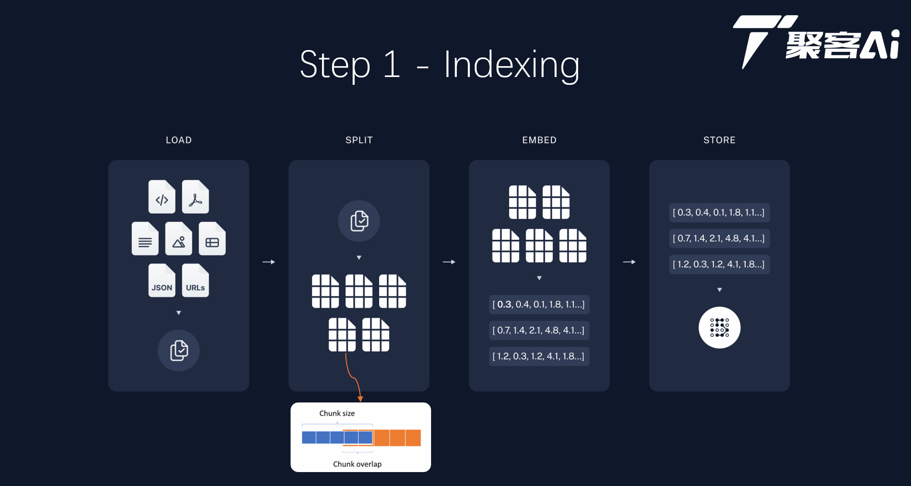
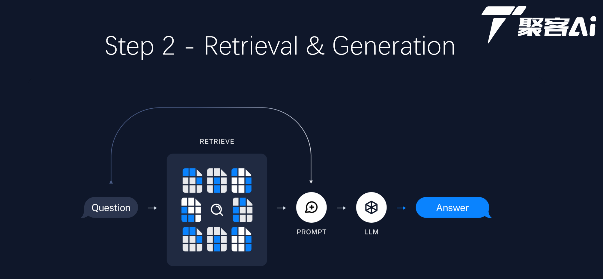

# 基于RAG的中医临床诊疗术语问答系统

<p align="center">
  
</p>

<p align="center">
  <a href="https://python.org"></a>
  <a href="https://streamlit.io"></a>
  <a href="https://llamaindex.ai"></a>
  <a href="https://help.aliyun.com/zh/dashscope"></a>
</p>

> 基于 **LlamaIndex + RAG (Retrieval-Augmented Generation)** 技术的中医临床诊疗术语问答系统。通过向量检索与生成式AI的结合，提供专业、准确的中医临床知识问答服务。

## ✨ 核心特性

- 🔍 **智能检索增强生成 (RAG)** - 结合向量检索与LLM生成，回答基于真实知识库
- 🤖 **中医专业领域** - 针对中医临床诊疗术语、证候知识进行优化
- 📝 **自定义中文Prompt** - 替换LlamaIndex默认英文模板，更贴合中文语境
- 🎯 **System Prompt身份约束** - 通过system角色注入中医助手身份，确保回答风格一致
- 📊 **LLM-as-Judge自动评估** - 内置忠实度(Faithfulness)与答案相关性(Relevance)评分
- ⚡ **索引持久化管理** - 支持索引的构建、保存、加载，无需重复处理文档
- 🖥️ **Streamlit交互界面** - 简洁美观的Web UI，支持示例问题、评估开关等功能
- 🛡️ **非中医问题拦截** - 自动识别并拦截与中医无关的查询

## 🏗️ 系统架构

<p align="center">
  
  
</p>

### RAG 工作流程

```
┌─────────────┐     ┌─────────────┐     ┌─────────────┐     ┌─────────────┐
│   文档加载   │────▶│   文本分块   │────▶│   向量嵌入   │────▶│   索引存储   │
│  Load Docs  │     │Split Chunks │     │   Embed     │     │    Store    │
└─────────────┘     └─────────────┘     └─────────────┘     └─────────────┘
                                                                    │
                                                                    ▼
┌─────────────┐     ┌─────────────┐     ┌─────────────┐     ┌─────────────┐
│   生成答案   │◀────│   LLM推理   │◀────│   上下文构建 │◀────│   向量检索   │
│   Answer    │     │     LLM     │     │   Context   │     │   Retrieve  │
└─────────────┘     └─────────────┘     └─────────────┘     └─────────────┘
                                                                  ▲
                                                                  │
                                                            ┌─────────────┐
                                                            │   用户提问   │
                                                            │    Query    │
                                                            └─────────────┘
```

## 🛠️ 技术栈

| 类别 | 技术 |
|------|------|
| **LLM框架** | [LlamaIndex](https://llamaindex.ai/) |
| **大语言模型** | Qwen-Max (阿里通义千问) |
| **Embedding模型** | text-embedding-v1 (DashScope) |
| **Web框架** | [Streamlit](https://streamlit.io/) |
| **向量维度** | 1536维 |
| **相似度计算** | Cosine Similarity |

## 📁 项目结构

```
tcm-clinical-rag-assistant/
├── 📁 config/
│   └── settings.yaml          # 配置文件
├── 📁 src/                    # 核心源码模块
│   ├── __init__.py
│   ├── config_loader.py       # 配置加载 & LLM初始化
│   ├── document_processor.py  # 文档加载 & 索引构建
│   ├── vector_store.py        # 向量存储持久化
│   ├── prompt_templates.py    # 中文Prompt模板
│   ├── rag_engine.py          # RAG查询引擎组装
│   └── evaluator.py           # LLM-as-Judge评估模块
├── 📁 webui/
│   └── app.py                 # Streamlit Web界面
├── 📁 data/                   # 中医知识文档
│   └── demo.txt               # 中医临床诊疗术语数据
├── 📁 doc_emb/                # 持久化向量索引
│   ├── default__vector_store.json
│   ├── docstore.json
│   └── index_store.json
├── 📁 assets/                 # 图片资源
├── 📁 .streamlit/
│   └── config.toml            # Streamlit配置
├── run.py                     # 启动脚本
├── requirements.txt           # 依赖列表
├── .env.example               # 环境变量示例
└── README.md                  # 项目说明
```

## 🚀 快速开始

### 1. 克隆项目

```bash
git clone https://github.com/yourusername/tcm-clinical-rag-assistant.git
cd tcm-clinical-rag-assistant
```

### 2. 安装依赖

```bash
pip install -r requirements.txt
```

### 3. 配置 API Key

复制 `.env.example` 为 `.env`，并填入你的 [阿里百炼](https://bailian.console.aliyun.com/) API Key：

```bash
cp .env.example .env
```

编辑 `.env` 文件：

```
DASHSCOPE_API_KEY=your_dashscope_api_key_here
```

> 💡 获取 API Key：[阿里百炼控制台](https://bailian.console.aliyun.com/?apiKey=1)

### 4. 启动应用

```bash
python run.py
```

然后在浏览器中打开 `http://localhost:8501`

## 📖 使用指南

### 界面功能

1. **左侧边栏**
   - 向量索引管理：构建新索引 / 加载已有索引
   - 评估模块开关：开启/关闭自动评估功能

2. **主界面**
   - 示例问题按钮：快速体验常见中医问题
   - 聊天输入框：输入你的中医相关问题
   - 答案展示区：显示回答及引用来源
   - 评估结果区：展示忠实度与相关性评分（0-10分）

### 示例问题

- "什么是气血两虚证？"
- "脾胃湿热有哪些临床表现？"
- "肝气郁结的治疗方法是什么？"

## 🔬 核心概念

### System Prompt vs QA/Refine Prompt

| Prompt类型 | 角色 | 作用 | 发送时机 |
|-----------|------|------|---------|
| **System Prompt** | System | 定义AI身份约束（"你是中医临床诊疗助手"） | 每轮对话 |
| **QA_TEMPLATE** | User | 任务指令：根据上下文回答（首次chunk） | 第一个文档块 |
| **REFINE_TEMPLATE** | User | 多chunk合并指令（后续chunks） | 第2+个文档块 |

### Response Mode: REFINE vs COMPACT

| 模式 | 特点 | 适用场景 |
|------|------|---------|
| **REFINE** | 顺序处理chunks，逐步精炼答案，质量高 | 追求答案质量（本项目使用） |
| **COMPACT** | 拼接所有chunks一次性生成，速度快 | 追求响应速度 |

### 评估指标 (LLM-as-Judge)

**忠实度 (Faithfulness)** - 0-10分
- 评估：生成的答案是否忠实于检索到的上下文
- 计算：LLM判断答案中的每个陈述是否都能在上下文中找到依据

**答案相关性 (Answer Relevance)** - 0-10分
- 评估：生成的答案是否回答了用户的问题
- 计算：LLM判断答案与查询意图的匹配程度

评估使用独立的LLM实例，`temperature=0.0`确保打分确定性。

## 🎯 关键技术决策

1. **索引持久化**：向量索引保存为JSON格式，支持快速加载，避免重复计算
2. **相似度过滤**：使用 `SimilarityPostprocessor(cutoff=0.6)` 过滤低相关性检索结果
3. **非中医问题拦截**：当 `source_nodes` 为空或 `top_score < 0.4` 时拒绝回答
4. **中文Prompt定制**：完全替换LlamaIndex默认英文模板，提升中文回答质量

## 📸 界面预览

<p align="center">
  <i>（添加你的应用截图到这里）</i>
</p>

## 📚 相关文档

- [项目彻底理解指南](./项目彻底理解指南.md) - 面试准备核心文档
- [LlamaIndex 官方文档](https://docs.llamaindex.ai/)
- [DashScope 阿里百炼文档](https://help.aliyun.com/zh/dashscope/)

## 🤝 贡献

欢迎提交 Issue 和 Pull Request！

## 📄 许可证

本项目采用 MIT 许可证 - 详见 [LICENSE](LICENSE) 文件

---

<p align="center">
  Made with ❤️ for Traditional Chinese Medicine
</p>
